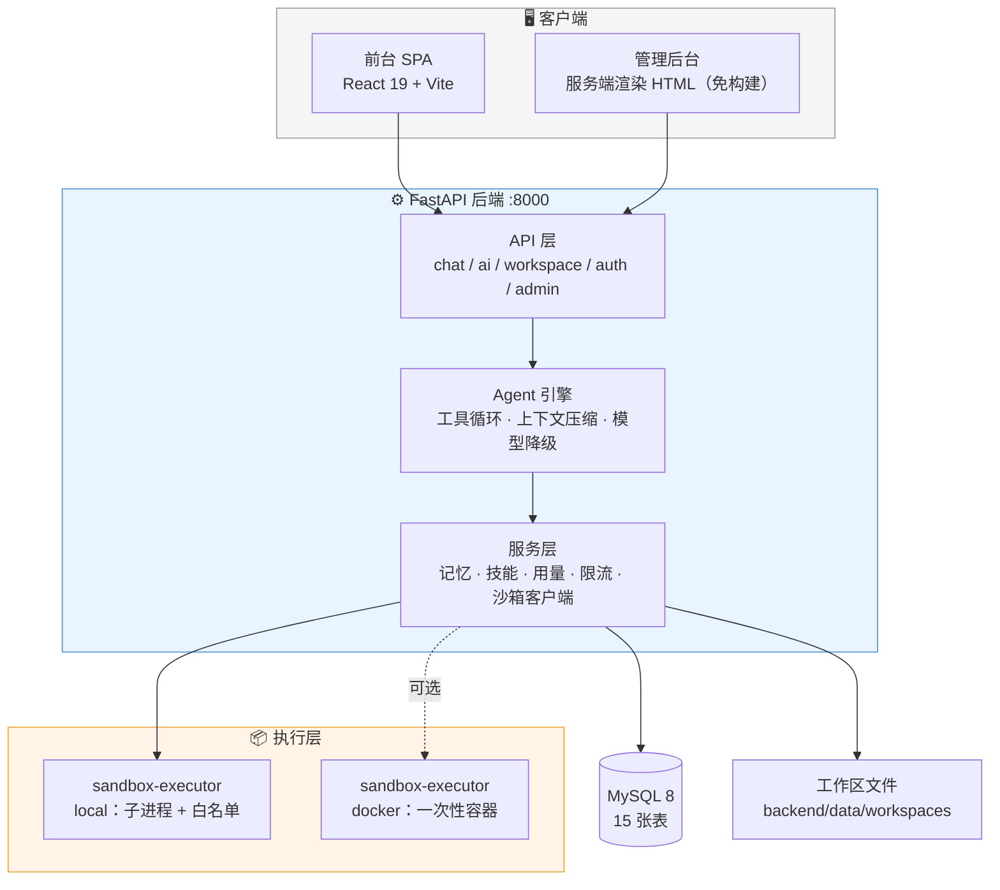

<div align="center">

# 🧭 Agent Harness

**自包含的 AI Agent 办公平台**

对话 · 执行代码 · 生成文档 · 调用技能 · 积累记忆

<sub>下载 → 配一个 LLM API Key → 就能跑。不需要 Docker，不需要构建前端。</sub>

<br/>

[](LICENSE)
[](https://www.python.org/)
[](https://fastapi.tiangolo.com/)
[](https://react.dev/)
[](https://www.mysql.com/)
[](#-参与贡献)

<br/>

[快速开始](#-5-分钟上手) · [能力](#-能干什么) · [架构](#-架构) · [配置](#-配置速查) · [技能系统](#-技能系统) · [排错](#-卡住了) · [路线图](#-路线图)

</div>

---

## ✨ 这是什么

一个**能真的动手干活**的 AI Agent，不是一个聊天框套壳。

模型写的 Python 会真的在你的工作区里跑起来 —— 算数据、画图表、生成 PDF/Word/Excel、读写文件。它还有记忆：对话后自动提取你的偏好，下次会话直接生效。想要新能力，往 `skills/` 里放一个 `SKILL.md` 就行，热插拔。

> **设计取向**：默认配置开箱即用，安全边界收敛在「模块白名单 + 路径边界」；
> 要对外提供服务时，一行配置切到 Docker 一次性容器隔离。宁可响亮地失败，也不静默降级。

---

## 🚀 5 分钟上手

```
准备 MySQL → 复制 .env 填 2 行 → 启动后端 → 登录后台填 API Key → 开聊
   ①            ②              ③           ④            ⑤
```

<details>
<summary><b>① 你需要先装好这些</b>（点击展开）</summary>

| 软件 | 版本 | 用途 |
|---|---|---|
| Python | 3.11+ | 跑后端 |
| MySQL | 8.0+ | 存数据 |
| Node.js | 18+ | **可选**，只有想跑前台开发态才需要 |
| 一个 LLM API Key | — | DeepSeek / OpenAI / Anthropic / 任何兼容厂商 |

</details>

### ② 建数据库

```sql
CREATE DATABASE agent_harness DEFAULT CHARACTER SET utf8mb4 COLLATE utf8mb4_unicode_ci;
```

### ③ 配置（只需填 2 行）

```bash
cd backend
cp .env.example .env
```

打开 `.env`，填这两项：

```ini
DB_PASSWORD=你的数据库密码
JWT_SECRET=随便一串随机字符
```

> JWT_SECRET 生成：`python -c "import secrets; print(secrets.token_urlsafe(48))"`

### ④ 启动

```bash
cd backend
python -m venv env
source env/bin/activate        # Windows: env\Scripts\activate
pip install -r requirements.txt
python -m uvicorn app.main:app --host 0.0.0.0 --port 8000
```

首次启动会自动建表 + **创建管理员**，密码打印在日志里：

```
============================================================
  已创建初始管理员
  登录账号：admin@local
  初始密码：xxxxxxxxxxxx
============================================================
```

### ⑤ 登录并填 API Key（3 步）

打开 **http://localhost:8000/admin**，用上面的账号登录，然后：

| 步骤 | 页面 | 操作 |
|---|---|---|
| 1 | `/admin/ai` → 厂商管理 | 新增厂商：填 Base URL + API Key |
| 2 | `/admin/ai` → 对话模型 | 新增模型：如 `deepseek-chat`（可点「🔍 自动发现」列出全部可用模型） |

完成。在管理端就能直接测试对话；要更好的界面，启动前台（见下方折叠块）后打开 **http://localhost:5173**。

<details>
<summary><b>想跑前台对话页面？（npm run dev）</b></summary>

```bash
cd frontend
npm install
npm run dev          # http://localhost:5173
```

生产部署不用跑它：`npm run build` 出的 `frontend/dist/` 会被后端自动挂载到根路径。

</details>

<details>
<summary><b>🖼 想给 Agent 加图像 / 视频生成能力？（可选）</b></summary>

仓库自带 [`media-router`](backend/data/skills/media-router/) 技能，支持通义万相（DashScope）等多厂商图像/视频模型。

1. 管理端 `/admin/ai` → **图像/视频配置** 标签页 → 点「启动配置页面」
2. 在打开的页面里填入你的 DashScope API Key 并挑选模型
3. Agent 即可通过 `media_generate` 工具生图/生视频，产物直接落到工作区

> 密钥保存在 `config/secrets.web.yaml`（已在 `.gitignore` 中，不会进仓库）。

</details>

---

## 🎯 能干什么

| 能力 | 说明 |
|---|---|
| **AI 对话** | 流式输出、多轮工具调用（Agent 循环）、模型降级、上下文自动压缩 |
| **代码执行** | 模型写代码真的跑：算数据、画图表、读写工作区文件（**14 个内置工具**） |
| **图像 / 视频生成** | 通过 `media-router` 技能接入多厂商模型，产物落工作区 |
| **文档生成** | PDF / Word / Excel / Markdown |
| **技能系统** | 放一个 `SKILL.md` 目录就能给 Agent 添能力，可热插拔 |
| **长期记忆** | 对话后自动提取你的偏好，下次会话直接生效 |
| **工作区** | 每用户独立文件空间，版本快照 + 回收站 |
| **多厂商** | OpenAI 与 Anthropic 协议都支持，主模型挂了自动降级到备选 |
| **用量与限流** | 按天统计 token 消耗，支持按用户/模型限速 |
| **管理后台** | 服务端渲染，免构建，改完重启即生效 |

### 内置工具一览

| 类别 | 工具 |
|---|---|
| 文件 | `read_file` `write_file` `edit_file` `delete_file` `rename_file` `revert_file` `list_files` `search_files` |
| 执行 | `run_python` |
| 技能 | `skill` `read_skill_file` |
| 记忆 | `remember` `recall` |
| 多媒体 | `media_generate` |

---

## 🏗 架构



<details>
<summary><b>技术栈与目录速览</b></summary>

- **后端**：Python 3.11+ · FastAPI · SQLAlchemy · MySQL 8
- **前端**：React 19 · Vite · TanStack Router · Tailwind
- **执行器**：本地子进程（默认）/ 一次性 Docker 容器（可选）
- `backend/app/services/` —— 核心：Agent 引擎、工具注册表、记忆、技能
- `backend/app/admin_pages/` —— 管理界面，纯 Python 拼 HTML，改完重启即生效
- `backend/data/skills/` —— 技能目录，每个子目录一个 `SKILL.md`
- `sandbox-executor/` —— 独立执行器 + systemd 部署单元

</details>

<details>
<summary><b>目录结构</b></summary>

```
agent-harness/
├── backend/
│   ├── app/
│   │   ├── api/v1/            # 路由：chat / ai / workspace / auth / admin
│   │   ├── admin_pages/       # 管理后台页面（服务端渲染）
│   │   ├── core/              # 配置、数据库、安全
│   │   ├── models/            # SQLAlchemy 模型（15 张表）
│   │   └── services/          # ★ 核心：Agent 引擎、工具、记忆、技能…
│   ├── data/skills/           # 技能目录
│   ├── .env.example           # 配置模板（每项都有中文注释）
│   └── requirements.txt
├── frontend/                  # React SPA
│   └── src/                   # 组件 / hooks / lib / pages
├── sandbox-executor/          # 代码执行隔离层
│   ├── executor.py
│   ├── DEPLOY.md              # Docker 模式部署步骤
│   └── *.service / *.timer    # systemd 单元
├── docs/
└── LICENSE
```

</details>

<details>
<summary><b>改这个项目前值得知道的取舍</b></summary>

- 管理端是服务端渲染 HTML，改完**重启后端即生效**，无前端构建
- 对话引擎**每次请求都读数据库配置**，改配置不用重启
- 工具描述与系统提示词共同定义 Agent 能力边界，要一起改
- 模型降级链：主模型失败自动换备选，避免单点中断
- 沙箱执行失败**不静默降级**：docker 模式挂了就直接报错

</details>

---

## ⚙️ 配置速查

完整说明在 [`backend/.env.example`](backend/.env.example)（每项都有中文注释）。常用的：

| 变量 | 说明 |
|---|---|
| `DB_*` | MySQL 连接信息 |
| `JWT_SECRET` | **生产必改**，默认值 = 任何人可伪造登录令牌 |
| `QQ_EMAIL` / `QQ_EMAIL_AUTH_CODE` | **留空 = 关闭注册**，只有管理员能用。想开放注册才配（QQ 邮箱要申请授权码，不是登录密码） |
| `INITIAL_ADMIN_PASSWORD` | 想自己指定管理员密码就填这里，否则随机生成打印一次 |
| `SANDBOX_BACKEND` | 代码执行的隔离模式，见下节 |

---

## 🔒 代码执行的安全模式

模型写的代码本质是不可信输入。两种执行模式：

| 模式 | 隔离手段 | 适用场景 |
|---|---|---|
| **`local`**（默认） | 本机子进程 + 模块白名单 + 路径边界 | 自用、内网，零配置 |
| **`docker`**（可选） | 一次性容器：断网、只读、无特权、内存/进程限额 | 对公网开放、多人使用 |

Docker 模式支持单机部署，步骤见 [`sandbox-executor/DEPLOY.md`](sandbox-executor/DEPLOY.md)。

> 设计取舍：docker 模式下执行器挂了会**直接报错**，不会悄悄退回 local ——
> 静默降级等于故障时撤掉隔离，宁可响亮地失败。

---

## 🧩 技能系统

技能 = `backend/data/skills/<名称>/` 下放一个 `SKILL.md`：

```markdown
---
name: my-skill
description: 这个技能做什么、什么时候该用它（模型会读到这句）
---

# 给模型的操作说明写在这里
```

两种添加方式：管理端 `/admin/skills` 传 ZIP / 从 Git 导入（自动注册），
或手动拷目录后到管理端点「扫描注册」。

> ⚠️ 只拷目录不注册不生效 —— 技能需要写进数据库。

---

## 🩺 卡住了？

| 症状 | 原因与解法 |
|---|---|
| 启动报数据库连接失败 | 检查 `.env` 的 DB_PASSWORD / MySQL 是否在跑（`mysql -u root -p` 能进吗） |
| pip 装依赖很慢 | 换国内源：`pip install -r requirements.txt -i https://pypi.tuna.tsinghua.edu.cn/simple` |
| 对话报「无可用模型」 | API Key 没配或模型没启用 —— 回 `/admin/ai` 检查第 ⑤ 步 |
| 登录 401 | 密码在**启动日志**里，只打印一次；忘了就删库里的 users 表重启，或设 `INITIAL_ADMIN_PASSWORD` 后重建 |
| 5173 打不开 | 前台没启动，先 `npm run dev`；或直接用 8000 的管理端 |
| 生图/生视频报无可用模型 | 去 `/admin/ai` → 图像/视频配置 里配模型和密钥 |
| 视频时长/分辨率与请求不符 | 部分厂商模型会忽略这两个参数，属模型行为，非本项目问题 |

---

## 🗺 路线图

- [x] Agent 工具循环 + 14 个内置工具
- [x] 技能系统（ZIP / Git 导入，热插拔）
- [x] 长期记忆自动提取
- [x] 多厂商 + 模型降级链
- [x] Docker 沙箱执行器
- [x] 图像 / 视频生成技能（media-router）
- [ ] 更多厂商适配（本地模型 / Ollama）
- [ ] 技能市场：一键安装社区技能
- [ ] 多用户协作与共享工作区

---

## 🤝 参与贡献

欢迎 Issue 和 PR。

1. Fork 本仓库
2. 新建分支：`git checkout -b feat/your-feature`
3. 提交前请确认**没有把 `.env`、密钥、工作区数据**一起提交（已在 `.gitignore`，但请自行复核）
4. 发起 Pull Request，描述清楚动机和改动范围

> 提交真实 LLM 接口相关的代码时，请勿粘出任何 API Key。

---

## 📄 许可证

[MIT](LICENSE) —— 随便用，包括商用。

<div align="center">
<sub>如果这个项目对你有帮助，给个 ⭐ 是最实在的支持</sub>
</div>
